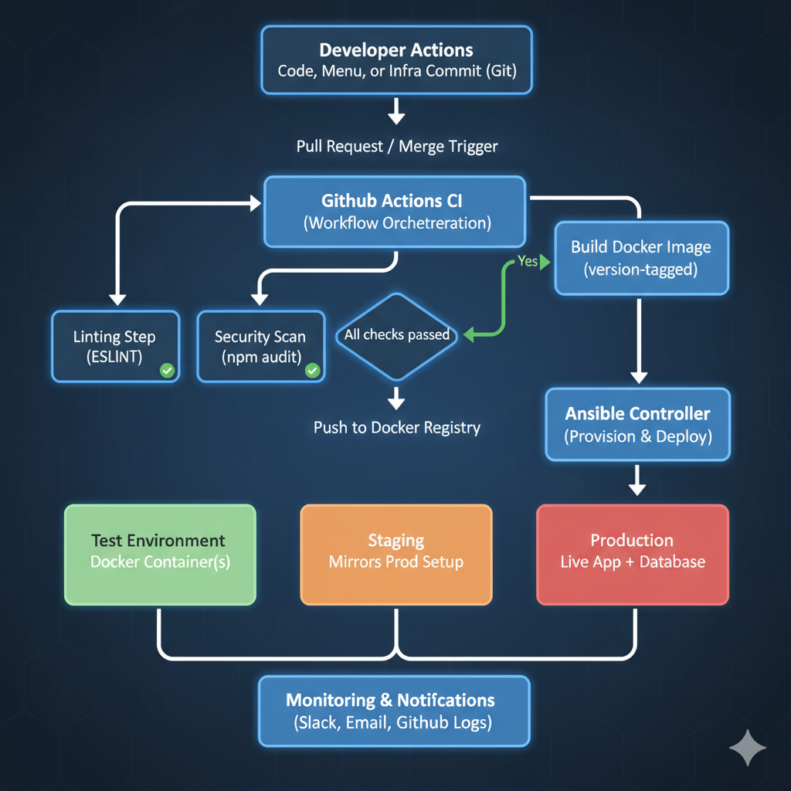

# CSC 519: DevOps Project

## **Cloud Kitchen Platform - DevOps Pipeline Proposal**

### **Solo Project by:** *Anchal Kakadia (akakadi)*

---

## 🧩 **Problem Statement & Description**

### **The Problem**
Cloud kitchen platforms must frequently update live menus because dishes may go out of stock (maybe due to ingredient shortages), and today’s specials or seasonal offerings change quite often.  
In many existing systems, these updates require **manual deployment**, configuration edits on production servers, or even full restarts.  

Such manual processes lead to:
- Inconsistent environments  
- Downtime during meal rush hours  
- Increased risk of untested updates reaching production  

---

### **Why Is It Important?**
For a cloud kitchen, **uptime and menu accuracy are critical**.  
If unavailable items remain visible, customers place invalid orders that later must be canceled thus wasting time and breaking trust.  

Manual redeployments also cause:
- Reduced developer productivity  
- Inconsistent environments  
- Late-night emergency fixes  

The DevOps challenge: enable **atomic, consistent, and rapid deployments** of frequent updates so that the the platform is continuously available and stable.

---

### **Solution**
A **CI/CD pipeline** that automates every step from commit to deployment for a cloud kitchen web platform.

The platform will:
- Be developed from scratch  
- Include APIs for **menu management, order processing, and kitchen operations**  
- Automatically trigger the pipeline when a menu item is updated  

**Pipeline actions include:**  
Linting → Testing → Containerization → Deployment → Rollback (if needed)  

Each deployment:
- Builds a **versioned Docker image**  
- Ensures **atomic, consistent, and reversible** updates  
- Eliminates downtime for live systems  

---

## 🍽️ **Tagline**

> ### **“ChefOps: Serving seamless deployments, hot and ready.”**

---

## 🔁 **Use Case: Update Menu Item Availability**

### **Preconditions**
- Developer has access to the repository  
- Release branch and GitHub Actions workflows are configured  
- Deployment environments (test & production) are provisioned with Ansible  

---

### **Main Flow**

1. Developer commits a change suppose to the `menu.json` file (e.g., marks “Margherita Pizza” as out of stock).  
2. Developer submits a **Pull Request (PR)** to merge this change into the release branch.  
3. **GitHub Actions** runs:
   - Linting (`ESLint`)
   - Testing (`Jest`)  
4. If checks pass:
   - A **Docker image** is built, tagged, and pushed to the **GitHub Container Registry**  
5. **Ansible** deploys the updated container to the **staging** environment.  
6. Once validated, the system **promotes** it to **production**.  
7. The **live menu updates instantly**, removing unavailable dishes.  
8. GitHub Actions posts a **success message** to Slack (or similar).  

---

### **Alternative Flows**

| Scenario | Description |
|-----------|--------------|
| **Invalid JSON** | If `menu.json` fails validation, the pipeline halts and notifies the developer. |
| **Test Failure** | If Jest tests fail, the PR cannot be merged. |
| **Deployment Failure** | If Ansible deployment fails, the system rolls back to the previous stable image. |
| **Manual Rejection** | If the PR isn’t approved, no deployment steps are executed. |

---

## ⚙️ **Pipeline Design**

### **Architecture Overview**
The **ChefOps** pipeline automates build, test, and deployment for the cloud kitchen platform.  
It follows a modular **CI/CD architecture** using **GitHub Actions**, **Docker**, and **Ansible** to ensure consistency, automation, and atomic deployments.

---

### **Architecture Diagram**

**Image Credit:** Diagram generated using Google Gemini based on textual description of the pipeline workflow.

---

### **Architecture Components**

| **Component** | **Role** | **Technologies / Tools** | **Details** |
|----------------|-----------|---------------------------|--------------|
| **Source Control** | Versioning and collaboration | **GitHub** | Hosts code, workflows, and branches. PR merges trigger CI/CD workflows. |
| **CI/CD Orchestration** | Automates build and deployment | **GitHub Actions** | Executes linting, testing, building, and deployment workflows. |
| **Linting Step** | Enforces code quality | **ESLint** | Runs on each PR/commit to catch syntax and style errors. |
| **Testing Step** | Validates functionality | **Jest** | Runs unit and integration tests for menu APIs and logic. |
| **Security Check** | Detects vulnerabilities | **npm audit**, **Dependabot** | Scans for known dependency vulnerabilities. |
| **Containerization** | Ensures environment consistency | **Docker** | Packages the app into versioned containers. |
| **Image Registry** | Stores Docker images | **DockerHub / GHCR** | Central repository for versioned images. |
| **Configuration Management** | Automates provisioning and deployment | **Ansible** | Deploys containers to test/staging/prod environments. |
| **Deployment Targets** | Hosts running applications | **VMs or Cloud Instances (NCSU VM)** | Runs containers; may use blue-green or rolling updates. |
| **Monitoring & Notifications** | Tracks pipeline status | **GitHub Actions logs, Slack, Email hooks** | Sends build, test, and rollback notifications. |
| **Data Storage** | Persists kitchen/menu data | **MongoDB (Atlas or local)** | Stores orders, menu items, and availability data. |
| **Rollback Mechanism** | Restores stable builds | **Ansible + Docker Image Tags** | Automatically reverts deployment if tests fail. |

---

